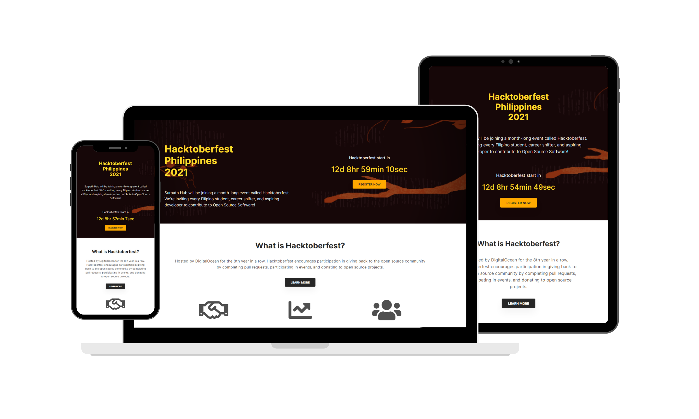

# Welcome to Hacktoberfest PH Community! 
Surpath Hub will be joining in a month-long event called [Hacktoberfest](https://hacktoberfest.digitalocean.com/).

The SurPath Hub will encourage every Filipino student, career shifter, and aspiring developer to contribute to Open Source Software.

[Live View](https://surpathhub.github.io/hacktoberfest-philippines/)

**Note:** Anyone can help improve our projects, but only those residing in the Philippines are encouraged to join our organization and participate in our events. We have [EddieHub Community](https://www.eddiehub.org/) as our global, open-source community for everyone.

## How to Contribute
1. [Fork](https://help.github.com/articles/fork-a-repo/) this project
2. [Clone](https://help.github.com/articles/fork-a-repo/#step-2-create-a-local-clone-of-your-fork) your forked version `git clone git@github.com:<YOUR-USERNAME>/hacktoberfest-philippines.git`
3. Make changes 
4. [Commit](https://help.github.com/articles/adding-a-file-to-a-repository-using-the-command-line/) your changes (write a short descriptive message of what you have done)
5. [Push](https://help.github.com/articles/pushing-to-a-remote/) yours changes to your forked version
6. Go to original project on GitHub & Create a [Pull Request](https://help.github.com/articles/about-pull-requests/)

Read the full details of the [contributing guidelines](https://github.com/SurPathHub/hacktoberfest-philippines/blob/main/CONTRIBUTING.md)

> Questions can be asked by raising an [issue](https://github.com/SurPathHub/hacktoberfest-philippines/issues). Have you found any bugs? You may raise an issue too.

## Hacktoberfest Practice Pull Requests

Visit this repository to practice Pull Request 👉 [hacktoberfest-practice](https://github.com/EddieHubCommunity/hacktoberfest-practice)

## Learn more about Hacktoberfest by clicking the poster below 👇

Hosted by https://hacktoberfest.digitalocean.com/

### Recent SWAG (Stuff We All Get)
- <a href="https://github.com/SurPathHub/hacktoberfest-philippines/issues/9">Hacktoberfest 2020</a>
